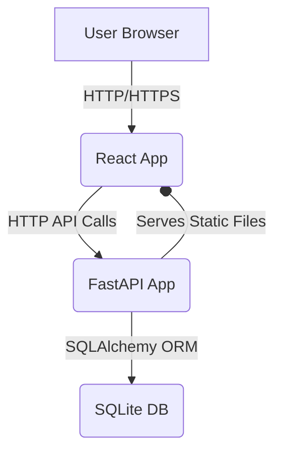

# Technical Overview of the Kids Learning App

This document provides a technical overview of the Kids Learning App, detailing its architecture, key technologies, and implementation specifics. It is intended for both human engineers and AI coding agents to understand, maintain, and extend the application.

## 1. Introduction

The Kids Learning App is a single-user web application designed to help children with early language and image recognition skills. It features various interactive games, including Word-Match, Image-Match, First Letter Match, and Inverse First Letter Match, with support for multiple difficulty levels and localization.

## 2. Architecture

The application follows a client-server architecture, containerized using Docker.

*   **Frontend:** A React application providing the user interface and game logic.
*   **Backend:** A FastAPI application serving API endpoints and managing game data.
*   **Database:** A SQLite database for persistent storage of word sets and trial results.

## 3. Key Technologies

*   **Backend:**
    *   **Python 3.12:** Primary programming language.
    *   **FastAPI:** High-performance web framework for building APIs.
    *   **SQLAlchemy:** Python SQL Toolkit and Object Relational Mapper (ORM) for database interaction.
    *   **SQLite:** Lightweight, file-based relational database.
    *   **Pydantic:** Data validation and settings management.
*   **Frontend:**
    *   **React 18:** JavaScript library for building user interfaces.
    *   **Vite:** Fast build tool for modern web projects.
    *   **`react-router-dom`:** Declarative routing for React.
    *   **`swr`:** React Hooks for data fetching with caching and revalidation.
    *   **`react-i18next`:** Internationalization framework for React.
    *   **CSS:** For styling, utilizing CSS variables for theming.
*   **Containerization:**
    *   **Docker:** For containerizing the frontend and backend services.
    *   **Docker Compose:** For defining and running multi-container Docker applications.

## 4. Backend Details

The backend is a FastAPI application responsible for:
*   Serving API endpoints for game data and results.
*   Managing word sets and trial results in the SQLite database.
*   Dynamically generating game questions based on image assets.
*   Serving static image files.

### 4.1. Application Structure (`app_backend/`)

*   `main.py`: The main FastAPI application, defining routes and business logic.
*   `db.py`: Configures the SQLAlchemy engine and session.
*   `models.py`: Defines SQLAlchemy ORM models for `WordSet`, `WordEntry`, and `TrialResult`.
*   `settings.py`: Manages application settings, including the database URL and static file directories.
*   `utils.py`: Contains utility functions (e.g., Levenshtein distance, though not actively used in current dynamic games).
*   `init_db.py`: Script to initialize database tables (executed during Docker build).

### 4.2. Database Interaction

*   **ORM:** SQLAlchemy is used to interact with the SQLite database. Models are defined in `app_backend/models.py`.
*   **Database URL:** Configured in `app_backend/settings.py` as `sqlite:///./data/wordmatch.db`. The database file `wordmatch.db` is created within the `/app/data` directory inside the backend container and persisted using a Docker named volume.
*   **Initialization:** The `init_db.py` script calls `Base.metadata.create_all(bind=engine)` to create tables. This script is executed during the Docker backend image build process to ensure the database schema is ready when the application starts.

### 4.3. API Endpoints (`app_backend/main.py`)

*   `GET /api/wordsets`:
    *   **Response Model:** `List[WordSetWithStats]`
    *   **Description:** Returns a list of all available game word sets, including dynamic games ("Which letter does the word start with?", "Which word matches the picture? (Easy)", "Which picture matches the word? (Easy)", "Which word matches the picture?", "Which picture matches the word?") and any user-defined sets loaded from `my_set.yaml`. Each entry includes the `id`, `title`, and the `best` score recorded for that set.
    *   **Implementation Notes:** The `list_wordsets` function dynamically prepends the hardcoded dynamic game entries and then appends database-loaded `WordSet` entries. It queries `TrialResult` to fetch the `best` score for each `wordset_id`.

*   `GET /api/wordsets/{wordset_id}/next`:
    *   **Response Model:** `List[NextEntry]`
    *   **Description:** Fetches a batch of word-match questions for a given `wordset_id`. Used by "Which word matches the picture?" and its easy variant.
    *   **Parameters:** `size` (number of questions), `max_len` (max word length filter), `lev` (Levenshtein distance for distractors).
    *   **Implementation Notes:** For dynamic sets (`dynamic`, `dynamic-easy`), it scans the `images/` directory, extracts word stems, and generates scrambled choices. The number of distractors varies based on `wordset_id` (1 for easy, 3 for standard).

*   `GET /api/wordsets/{wordset_id}/next-images`:
    *   **Response Model:** `List[NextImageEntry]`
    *   **Description:** Fetches a batch of image-match questions for a given `wordset_id`. Used by "Which picture matches the word?" and its easy variant.
    *   **Parameters:** `size`, `max_len`.
    *   **Implementation Notes:** Similar to `next`, but generates image choices (one correct image, three distractor images) based on the first letter of the word. The number of distractors varies based on `wordset_id`.

*   `GET /api/wordsets/{wordset_id}/first-letter`:
    *   **Response Model:** `List[FirstLetterEntry]`
    *   **Description:** Fetches a batch of "Which letter does the word start with?" questions.
    *   **Parameters:** `size`.
    *   **Implementation Notes:** Selects images, extracts the first letter of their stem, and generates choices including the correct first letter and three random letters from the German alphabet as distractors.

*   `GET /api/wordsets/{wordset_id}/inverse-first-letter`:
    *   **Response Model:** `List[InverseFirstLetterEntry]`
    *   **Description:** Fetches a batch of "Inverse First Letter Match" questions.
    *   **Parameters:** `size`.
    *   **Implementation Notes:** Selects a random letter, then finds an image starting with that letter and three distractor images that do not.

*   `POST /api/trials`:
    *   **Request Model:** `TrialCreate`
    *   **Response Model:** `TrialResponse`
    *   **Description:** Records the result of a game trial (score for a specific word set).
    *   **Implementation Notes:** Stores the `wordset_id`, `correct` score, and `answered_at` timestamp in the `trial_results` table. Includes logging for debugging.

*   `GET /api/stats/{wordset_id}`:
    *   **Response Model:** `StatsResponse`
    *   **Description:** Retrieves the best score and total games played for a given `wordset_id`.

## 5. Frontend Details

The frontend is a React application built with Vite, providing a responsive and interactive user experience.

### 5.1. Application Structure (`frontend/src/`)

*   `main.jsx`: Entry point for the React application.
*   `App.jsx`: Defines the main application component and React Router routes.
*   `i18n.js`: Configures `react-i18next` for internationalization. Currently forces German (`de`) language.
*   `utils/fetcher.js`: A utility for making API calls using `fetch` and `swr`. Dynamically determines the `API_BASE` URL based on `window.location.hostname` for cross-device access.
*   `assets/feedback/`: Contains image assets for feedback (correct, wrong, neutral).
*   `locales/en/translation.json`, `locales/de/translation.json`: JSON files for English and German translations.
*   `components/AppCard.jsx`: Reusable component for displaying game cards on the landing page.
*   `pages/`: Contains individual page components for each game type and the landing page.
    *   `Landing.jsx`: Displays the grid of `AppCard` components.
    *   `WordMatch.jsx`: Implements the Word-Match game logic and UI.
    *   `ImageMatch.jsx`: Implements the Image-Match game logic and UI.
    *   `FirstLetterMatch.jsx`: Implements the First Letter Match game logic and UI.
    *   `InverseFirstLetterMatch.jsx`: Implements the Inverse First Letter Match game logic and UI.
*   `index.css`: Global CSS styles, including CSS variables for theming (light/dark mode) and general button styles.

### 5.2. State Management and Data Flow

*   **`swr`:** Used extensively for data fetching from backend API endpoints. It handles caching, revalidation, and provides loading and error states.
*   **React Hooks (`useState`, `useEffect`):** Used within components to manage local state (e.g., current question index, score, feedback, selected choices) and side effects.
*   **Game Flow:**
    *   Game components fetch a `batch` of questions from their respective backend endpoints.
    *   `handleSelect` function processes user input, updates score/errors, sets feedback, and manages the `hasResponded` state to prevent multiple selections per question.
    *   For correct answers, a `setTimeout` is used to display positive feedback briefly before automatically advancing to the next question.
    *   For incorrect answers, a "Continue" button appears, allowing the user to review feedback before manually proceeding.
    *   Upon game completion, a `POST` request is sent to `/api/trials` to record the score.
    *   `mutate('/api/wordsets')` is called after game completion to trigger a re-fetch of the landing page data, ensuring the best scores are updated.

### 5.3. Styling

*   **CSS Modules/Global CSS:** A combination of global styles (`index.css`) and component-specific CSS files (e.g., `WordMatch.css`).
*   **CSS Variables:** Used for consistent theming (light/dark mode) across the application.
*   **Responsive Design:** Media queries are used to adjust layouts for different screen sizes.
*   **Button Styling:** Custom styles are applied to game choice buttons and the "Continue" button for visual appeal and usability. Long words in buttons are handled by flexible font sizing (`clamp()`) and increased container/button widths, without using word wrap.

## 6. Dockerization

The application is fully containerized using Docker and managed with Docker Compose.

*   **`docker-compose.yml`:** Defines two services: `backend` and `frontend`.
    *   **`backend` service:**
        *   Builds from `app_backend/Dockerfile`.
        *   Exposes port `8000` to the host.
        *   Mounts `./images` and `./static` as read-only volumes.
        *   Uses a named volume `wordmatch_data` for `/app/data` to persist the SQLite database.
    *   **`frontend` service:**
        *   Builds from `frontend/Dockerfile`.
        *   Exposes port `3000` to the host.
        *   Depends on the `backend` service.
        *   `VITE_API_BASE_URL` is dynamically set in `fetcher.js` to `http://<host_ip>:8000` for cross-device access.
*   **`app_backend/Dockerfile`:**
    *   Uses `python:3.12-slim` as the base image.
    *   Installs Python dependencies from `requirements.txt`.
    *   **Installs `sqlite3`:** `RUN apt-get update && apt-get install -y sqlite3` to ensure the `sqlite3` command-line tool is available for debugging and the SQLite library is present.
    *   Creates `/app/data` directory and sets permissions (`RUN mkdir -p /app/data && chmod 777 /app/data`).
    *   Executes `python -m app_backend.init_db` during the build process to initialize the database schema.
*   **`frontend/Dockerfile`:**
    *   Uses `node:18-alpine` as the base image.
    *   Copies `package.json` and installs Node.js dependencies.
    *   Builds the React application using `npm run build`.
    *   Uses `serve` to serve the static build files.
*   **`docker-entrypoint.sh`:** A simple shell script that executes the `uvicorn` command to start the FastAPI backend. The database initialization is now handled during the Docker build process, so this script is simplified.

## 7. Development Workflow

The `Makefile` in the project root simplifies common development tasks:

*   `make build`: Builds Docker images for both frontend and backend.
*   `make up`: Starts the Docker containers in detached mode.
*   `make down`: Stops and removes the Docker containers.
*   `make clean`: Removes the `wordmatch.db` file (if it exists) and stops containers.
*   `make reset`: Cleans the database and restarts the Docker containers.
*   `make load-wordset`: Loads `my_set.yaml` into the database (run this after `make reset` to re-populate initial data).

To access the application from your local network, find your host machine's IP address and navigate to `http://<YOUR_HOST_IP_ADDRESS>:3000` in a web browser.

## 8. Future Considerations/Improvements

*   **User Authentication:** Implement a proper authentication system for multi-user support and personalized high scores.
*   **More Game Types:** Expand with additional educational games focusing on different aspects of language learning.
*   **Admin Interface:** A simple admin interface for managing word sets and reviewing trial results.
*   **Testing:** Implement comprehensive unit, integration, and end-to-end tests for both frontend and backend.
*   **CI/CD Pipeline:** Automate build, test, and deployment processes.
*   **Accessibility Audit:** Further improve accessibility for users with disabilities.
*   **Performance Optimization:** Optimize image loading, API responses, and frontend rendering for smoother performance on various devices.
*   **Error Logging/Monitoring:** Implement a more robust error logging and monitoring solution.
*   **Dynamic Content Management:** Allow dynamic word sets to be managed via an admin interface rather than relying on filesystem scanning.
*   **Theming/Customization:** Provide user-facing options for language and theme selection.
